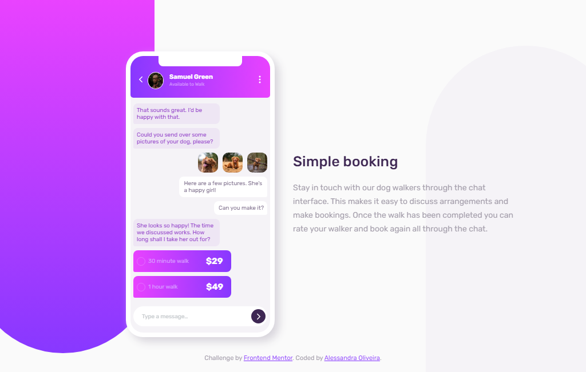
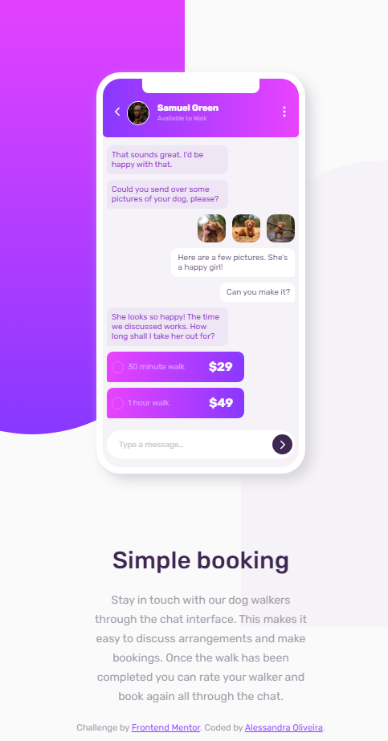

# Frontend Mentor - Chat App CSS Illustration Solution

This is a solution to the [Chat app CSS illustration challenge on Frontend Mentor](https://www.frontendmentor.io/challenges/chat-app-css-illustration-O5auMkFqY).

## Table of contents

- [Overview](#overview)
  - [The challenge](#the-challenge)
  - [Screenshot](#screenshot)
  - [Links](#links)
- [My process](#my-process)
  - [Built with](#built-with)
- [Author](#author)

## Overview

This is my solution to the chat app css illustration master challenge on Frontend Mentor

### The challenge

Users should be able to:

- View the optimal layout for the component depending on their device's screen size

### Screenshot

Here are two screenshots of how my solution looks like both for desktop and mobile devices

### Links

- Solution URL: [Solution on frontend mentor](https://your-solution-url.com)
- Live Site URL: [Live solution](https://your-live-site-url.com)

## My process

### Built with

- Semantic HTML5 markup
- CSS custom properties

## Author

- Frontend Mentor - [@itsale-o](https://www.frontendmentor.io/profile/itsale-o)
- LinkedIn - [Alessandra Oliveira](https://www.linkedin.com/in/alessandra-santos-oliveira/)
- Twitter - [@itsale_o](https://twitter.com/itsale_o)
